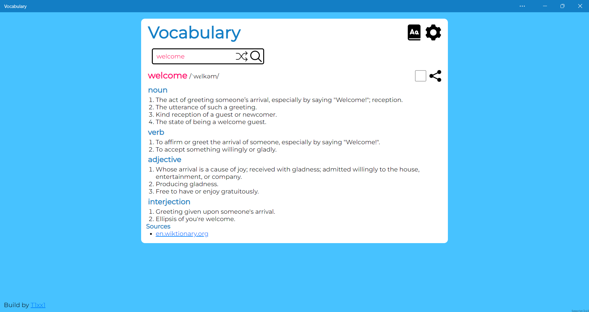
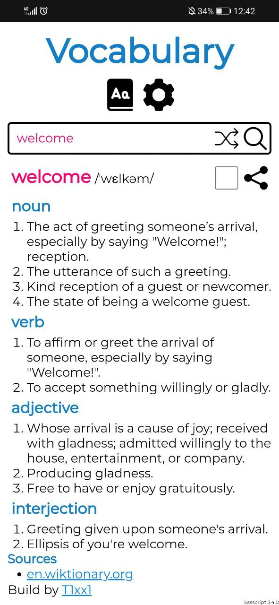

# [Vocabulary](https://t1xx1.github.io/Vocabulary)

Search words and learn them, get definitions, synonyms and antonyms.

## Index

-  [Changelog](CHANGELOG.md)
-  [Features table](features.md)
-  [Screenshoot](#screenshots)
-  [Installation](#installation)
-  [Authors](#authors)
-  [License](#license)

## Screenshots

## Installation

Use the website as a PWA

### Edge

> Three dots > apps > install this site as an app > install

### Chrome

> Three dots > add to home screen > add

## Color Reference

| Color             | Hex                                                       |
| ----------------- | --------------------------------------------------------- |
| Winter sky        |  #ff006e |
| Capri             |  #47c2ff |
| Star command blue |  #137ec5 |

## Authors

-  [T1xx1](https://github.com/T1xx1)

## License

[MIT](LICENSE)
